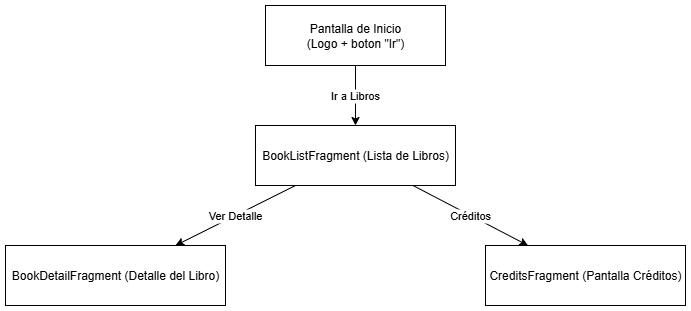
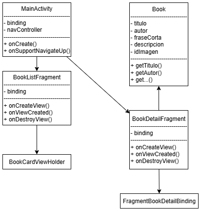

# EVALUACIÓN FINAL MÓDULO 4: DESARROLLO DE LA INTERFAZ DE USUARIO ANDROID - APLICACIÓN LIBROS

**Este documento proporciona una guía completa sobre la aplicación de Libros, desarrollada en Android. Aquí encontrarás una explicación paso a paso de su estructura, funcionamiento, y los conceptos de diseño aplicados.**

## 1. Requerimientos del Caso:

* **Contexto y Configuración de un Nuevo Proyecto:**
   - **Paso 1:** Crear el repo usando Github Desktop.
<p float="center">
  
</p>

   - **Paso 2:** Para configurar un nuevo proyecto en Android Studio, elige la opción "New Project". Esto abre un asistente que guía al usuario a través de varias plantillas.
     Para una aplicación nativa desde cero, se elige la plantilla **"Empty Views Activity"**. Esta plantilla proporciona una estructura de proyecto minimalista con una MainActivity y su respectivo archivo de diseño en XML (activity_main.xml), lo que permite un control total sobre la arquitectura de la interfaz de usuario.
<p float="center">
  
</p>

   - **Paso 3:** Configuración inicial. Una vez seleccionada la plantilla, se establecen tres configuraciones básicas en el asistente.
     * Nombre de la Aplicación y del Paquete: Se asigna un nombre visible para los usuarios (por ejemplo, "Buscador de Libros") y un nombre de paquete único que identifica la aplicación en la tienda de aplicaciones (por ejemplo, com.evalfinal.books2).
     * Versión Mínima del SDK (MinSDK): Se especifica la versión más antigua de Android con la que la aplicación será compatible. Se eligió la API 33 (Tiramisu), ya que permite el uso de características modernas de Material Design 3 y, a la vez, cubre a un porcentaje significativo de dispositivos del mercado, asegurando un equilibrio entre modernidad y compatibilidad. Esta configuración se refleja en el archivo build.gradle.kts del módulo de la aplicación.
     * Lenguaje de Programación: Se selecciona el lenguaje de programación principal. Para este proyecto, se optó por Java, dado su soporte maduro y su uso generalizado en la comunidad de desarrollo de Android. 
<p float="center">
  
</p>

   - **Paso 4:** Configuración inicial del “Manifest” (proyecto creado con sólo “MainActivity”, “activity_main”)
<p float="center">
  
</p>

   - **Paso 5:** Agregamos el recurso navigation, con nombre “nav”, y se agregan las librerías.
<p float="center">
  
   
</p>


c) Manejo y Optimización de Assets y Recursos
La gestión de assets en Android es fundamental para garantizar que la aplicación sea eficiente y visualmente atractiva en una amplia variedad de dispositivos. Los recursos se almacenan en directorios específicos dentro de la carpeta res/:

Imágenes (res/drawable/ y res/mipmap/):

res/drawable/ se usa para imágenes que se utilizan dentro de la interfaz de usuario (como las portadas de los libros).

res/mipmap/ se utiliza para los íconos de la aplicación que se muestran en el lanzador del dispositivo.

Diseños (res/layout/): Contiene los archivos XML que definen la estructura y el diseño de la interfaz de usuario.

La optimización de los assets es un paso crítico en el proceso de desarrollo. Es importante por las siguientes razones:

Rendimiento y Consumo de Memoria: Utilizar imágenes no optimizadas o de alta resolución innecesariamente puede causar problemas de rendimiento, como el consumo excesivo de memoria RAM, lo que puede llevar a errores de OutOfMemoryError y a cierres inesperados de la aplicación.

Tamaño de la APK: Los assets grandes y sin comprimir aumentan el tamaño del archivo de la aplicación (APK), lo que puede desalentar a los usuarios de descargarla, especialmente si tienen conexiones lentas o espacio de almacenamiento limitado.

Experiencia de Usuario: Una aplicación lenta en cargar recursos ofrece una experiencia de usuario deficiente. La optimización asegura que la interfaz se muestre de forma fluida y rápida en todos los dispositivos.

Para optimizar, se recomienda utilizar herramientas de compresión de imágenes, convertir imágenes al formato WebP y proporcionar diferentes versiones de un mismo recurso para distintas densidades de pantalla (mdpi, hdpi, xhdpi, etc.).

d) Gestión del Código Fuente con GitHub
La gestión del código fuente en este proyecto se llevó a cabo utilizando Git y GitHub para asegurar un control de versiones robusto y mantener el repositorio en un estado óptimo.

Repositorio Remoto: El proyecto se aloja en un repositorio remoto de GitHub, lo que facilita el seguimiento de los cambios y la colaboración.

Rama Principal (main): Se utilizó una única rama principal llamada main. Dado que este es un proyecto de desarrollo individual, una rama única es suficiente para mantener un historial de código lineal y evitar la complejidad de fusionar múltiples ramas.

Prácticas de Seguridad y Mantenimiento:

.gitignore: El archivo .gitignore es un componente esencial para la seguridad del repositorio. Se configuró para excluir archivos generados automáticamente por el IDE (como archivos de compilación, caché y de depuración) y así evitar subir información sensible o innecesaria. Esto mantiene el repositorio limpio y liviano.

Commits Atómicos y Descriptivos: Se realizaron commits pequeños y significativos, cada uno con un mensaje descriptivo que explicaba el propósito de los cambios. Esta práctica hace que sea fácil revisar el historial del proyecto y revertir a una versión anterior si es necesario.


## 1. Funcionamiento de la Aplicación

**La aplicación es una plataforma sencilla para visualizar un catálogo de libros. El flujo de usuario principal es el siguiente:**

* **Pantalla de inicio:** Al abrir la aplicación, se muestra una pantalla de bienvenida, con un logo centrado y botón. Al presionar el botón "Ir", el usuario es dirigido a la lista de libros (3 CardViews).
* **Lista de Libros:** En esta pantalla, se presenta un listado de libros con su título, autor y una breve descripción. Cada elemento tiene un botón para ver más detalles.
* **Detalle del Libro:** Al seleccionar un libro, se abre una nueva pantalla con información ampliada, como la sinopsis completa y una imagen más grande.
* **Barra de Navegación:** La aplicación incluye una barra de navegación inferior que permite al usuario moverse fácilmente entre las vistas de "Inicio", "Libros" y "Créditos".

## 2. Capturas de Pantalla

<p float="left">
  
  
  
  
  
  
</p>

## 3. Conceptos de Diseño y Arquitectura

**El desarrollo de esta aplicación se basó en el principio de separar la lógica de la interfaz de usuario, garantizando un código limpio, modular y fácil de mantener.**

* **Arquitectura de Componentes:** La aplicación se divide en <span class="selected">Activities</span> y <span class="selected">Fragments</span>. La <span class="selected">MainActivity</span> actúa como un contenedor para los <span class="selected">Fragments</span>, cada uno responsable de una pantalla o vista específica.
* **Navegación Segura (Android Jetpack Navigation):** Se utilizó el componente **Navigation de Android Jetpack** para gestionar las transiciones entre pantallas. Esto asegura que la navegación sea segura y que los datos se pasen correctamente entre fragmentos (<span class="selected">BookListFragment</span> a <span class="selected">BookDetailFragment</span> utilizando el objeto <span class="selected">Book</span>).
* **View Binding:** Para interactuar con los elementos de la interfaz de usuario (<span class="selected">TextViews</span>, <span class="selected">ImageViews</span>, etc.), se usó  **View Binding**. Esto elimina la necesidad de **<span class="selected">findViewById</span>**, reduciendo la posibilidad de errores y haciendo el código más conciso.
* **Flujo de Navegación Personalizado:** Se implementó una lógica de navegación manual en la <span class="selected">MainActivity</span> para controlar la pila de navegación (<span class="selected">back stack</span>). Esto permite que los botones de la barra de navegación actúen como puntos de partida, asegurando que la aplicación no se "pierda" al cambiar entre vistas.
* **Diagrama de Navegación** 
<p float="left">
  
</p>

## 4. Guía de Ejecución del Proyecto

**Para ejecutar este proyecto en tu entorno de desarrollo, sigue estos 'quick steps':**

1. **Clonar el Repo:** Clona el proyecto en tu máquina local.
2. **Abrir en Android Studio:** Abre la carpeta del proyecto con Android Studio. El IDE detectará automáticamente la configuración de Gradle.
3. **Sincronizar Gradle:** Haz clic en el botón "Sync Now" si Android Studio te lo solicita. Esto descargará todas las dependencias necesarias.
4. **Ejecutar:** Conecta un dispositivo Android físico o inicia un emulador. Luego, haz clic en el botón "Run 'app'" (el ícono de la flecha verde) para desplegar la aplicación.

**Para ejecutar este proyecto en tu celular, sigue estos 'quick steps':**

1. **Copiar la APK:** Copia la aplicación (APK) en tu celular.
2. **Instalar:** Instala la aplicación, salta los avisos de advertencia, es normal si la aplicación no ha sido productivizada la plataforma de Android.
3. **Abrir la App:** Haz doble clic en el ícono "Books2".
4. **Recorrer las opciones:** Cliquea en las opciones y podrás acceder al listado, el detalle o los créditos, regresando a cualquier punto de la app.

## 5. Estructura del Proyecto

**A continuación, se detalla la estructura principal del proyecto, con una breve descripción de cada archivo o carpeta.**

* <span class="selected">app/src/main/java/com/evalfinal/books2/</span>: Contiene la lógica principal de la aplicación.
  * <span class="selected">MainActivity.java</span>: La actividad principal que gestiona el contenedor de fragmentos y la barra de navegación.
  * <span class="selected">SplashFragment.java</span>: Lógica de la pantalla de bienvenida.
  * <span class="selected">BookListFragment.java</span>: Lógica del listado de libros.
  * <span class="selected">BookDetailFragment.java</span>: Lógica de la vista de detalles de un libro.
  * <span class="selected">CreditsFragment.java</span>: Lógica de la vista de créditos.
  * <span class="selected">Book.java</span>: Clase de modelo que define un objeto Libro.
* <span class="selected">app/src/main/res/layout/</span>: Contiene los archivos XML para las interfaces de usuario.
  * <span class="selected">activity_main.xml</span>: El diseño de la actividad principal.
  * <span class="selected">fragment_splash.xml</span>: Diseño de la pantalla de inicio.
  * <span class="selected">fragment_book_list.xml</span>: Diseño de la lista de libros.
  * <span class="selected">fragment_book_detail.xml</span>: Diseño de la pantalla de detalles.
  * <span class="selected">fragment_credits.xml</span>: Diseño de la pantalla de créditos.
* <span class="selected">app/src/main/res/navigation/</span>: Contiene el gráfico de navegación.
  * <span class="selected">nav.xml</span>: Define las transiciones y los destinos de los fragmentos.
* <span class="selected">app/src/main/res/menu/</span>: Contiene el menú para la barra de navegación.
  * <span class="selected">menu_bottom_nav.xml</span>: Define los íconos y títulos de la barra de navegación inferior.
* **Diagrama de clases**
<p float="left">
  
</p> 

## 6. Tecnologías Utilizadas
* **IDE:** Android Studio (Narwhal 3, basado en IntelliJ IDEA)
* **Lenguaje:** Java v21
* **Frameworks y librerías principales:** Jetpack, Navigation, Material.
* **Otras tecnologías:** Git, Github, Github Desktop.
* **API Mínima:** 33 
* **API Objetivo:** 36

## 7. Instalación y Configuración

a. **Clonar el repositorio:**

   ```bash
   https://github.com/jcordovaj/evalM4_v1.git
   
   ```

b. **Abrir el Proyecto en Android Studio:**

b.1. Abrir Android Studio.

b.2. En la pantalla de bienvenida, seleccionar **"Open an existing Android Studio project"** (Abrir un proyecto de Android Studio existente).

b.3. Navegar a la carpeta donde se clonó el repositorio y seleccionarla. Android Studio detectará automáticamente el proyecto de Gradle y comenzará a indexar los archivos.

c. **Sincronizar Gradle:**
   
c.1. Este es el paso más importante. Después de abrir el proyecto, Android Studio intentará sincronizar la configuración de Gradle. Esto significa que descargará todas las librerías, dependencias y plugins necesarios para construir la aplicación. Normalmente, una barra de progreso se mostrará en la parte inferior de la consola de Android Studio con un mensaje como **"Gradle Sync in progress"**.

c.2. Si no se inicia, o si el proceso falla, intente con el botón **"Sync Project with Gradle Files"** en la barra de herramientas. Es el icono con el **"elefante" de Gradle**.  Eso forzará la sincronización. 

c.3. Esperar que el proceso de sincronización termine. De haber errores, puede ser por problemas en la configuración de Android u otros conflictos, la aplicación debe descargar lo que requiera y poder ser ejecutada "AS-IS".

d. **Configurar el Dispositivo o Emulador:**

Para ejecutar la aplicación, se requiere un dispositivo Android, puedes usarse el emulador virtual o un dispositivo físico.

d.1. Emulador: En la barra de herramientas, haga click en el botón del "AVD Manager" (Android Virtual Device Manager), que es el icono de un teléfono móvil con el logo de Android. Desde ahí, puedes crear un nuevo emulador con la versión de Android que prefiera (Nota: Debe considerar que cada celular emulado, puede requerir más de 1GB de espacio en disco y recursos de memoria).

d.2. Dispositivo físico: Conecte su teléfono Android a la computadora con un cable USB (también puede ser por WI-FI). Asegúrese de que las **Opciones de desarrollador y la Depuración por USB** estén habilitadas en su dispositivo. Consulte a su fabricante para activar estas opciones.

e. **Ejecutar la aplicación:**

e.1. Seleccione el dispositivo o emulador deseado en la barra de herramientas del emulador.

e.2. Haga click en el botón "Run 'app'" (el triángulo verde en la parte superior, o vaya al menu "RUN") para iniciar la compilación y el despliegue de la aplicación, puede tardar algunos minutos, dependiendo de su computador.

e.3. Si todo ha sido configurado correctamente, la aplicación se instalará en el dispositivo y se iniciará automáticamente, mostrando la pantalla de inicio.

## 8. Contribuciones (Things-To-Do)

Se puede contribuir reportando problemas o con nuevas ideas, por favor respetar el estilo de programación y no subir código basura. Puede utilizar: forking del repositorio, crear pull requests, etc. Toda contribución es bienvenida.

## 9. Licencia

Proyecto con fines educativos, Licencia MIT
